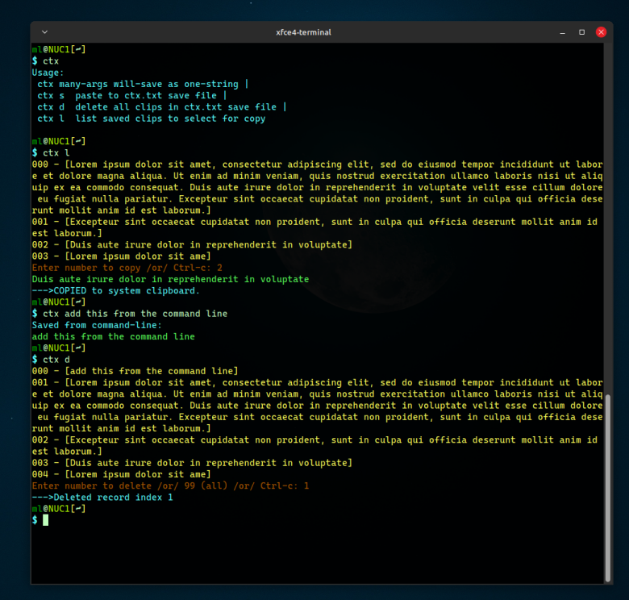

# ctx
### _command-line clipboard text saving / retrieving (exchange)_

Wrote this for fun. Don't know if I'll really use it much.
Incorporates several new functions I've added to the __myc.h__ project.  
Writing C functions to do cool stuff is fun &#x1F60A;

ctx lets you save and recall text from/to your system clipboard or command-line.
So you can choose previous saves to recall back to your clipboard.




Makes heavy use of the [my_h c library](https://github.com/MLeidel/myc "myc.h"):  
```c
readfile  
open_for_write, open_for_append  
strcon  
clr_fg color codes sturcture  
contains  
cbcopy  
cbpaste  
list_def  
list_split  
list_display  
list_remove
list_string
```

see: [my_h c library](https://github.com/MLeidel/myc "myc.h")

---

